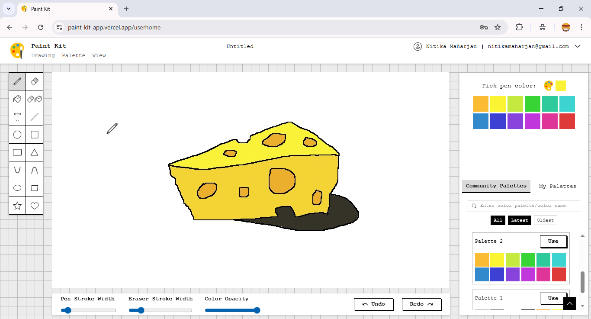
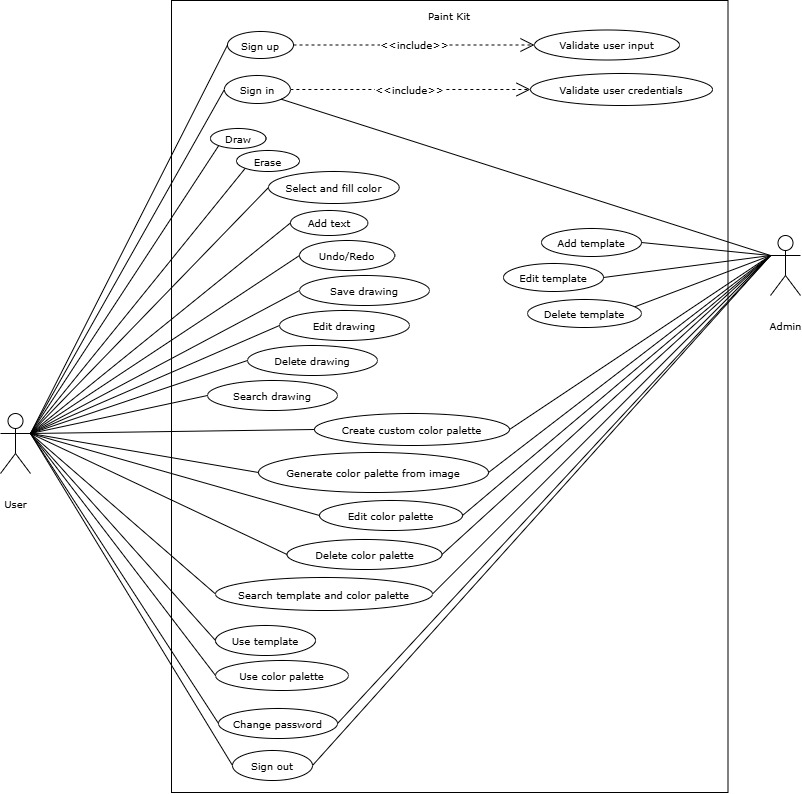

##  Paint Kit

**Paint Kit** is a web-based 2D drawing and painting application inspired by **MS Paint**, **ibisPaint**, and **Figma**. Built using the **MERN stack**, it integrates several core algorithms, including Bresenham’s line drawing, midpoint circle drawing, flood fill, stack-based undo/redo, and k-means clustering for automatic color palette generation from uploaded images.

## Preview

> Below is a preview of the Paint Kit interface, showcasing the drawing canvas and available tools.



## Live Demo

**Link:** [https://paint-kit-app.vercel.app](https://paint-kit-app.vercel.app)

**Note:** This application can only be used on desktop devices and is not optimized for mobile devices.

## Table of Contents

- [Key Features](#key-features)
- [Tech Stack](#tech-stack)
- [Getting Started](#getting-started)
- [Usage Instructions](#usage-instructions)
- [Future Roadmap](#future-roadmap)

## Key Features

> The following diagram highlights the core functionalities available to Admins and Users in Paint Kit.



### Use Cases of Admin

- **Admin Authentication** – sign in, sign out, change password
- **Dashboard Access** – access and navigate the admin dashboard
- **Template Management** – add, edit, delete, and search templates
- **Color Palette Management** – create, generate from images, edit, delete, and search color palettes

### Use Cases of User

- **User Authentication** – sign up, sign in, sign out, change password
- **Drawing & Painting Tools** – pen, eraser, bucket fill, text, shapes, stroke width adjustment, color opacity control
- **Utility Tools** – upload images, export as PNG/JPEG, undo/redo actions, view undo/redo history, clear canvas
- **Drawing Management** – save, edit, delete, and search drawings
- **Color Palette Management** – create, generate from images, edit, delete, and search color palettes
- **Template & Palette Usage** – draw and color using admin-provided templates and palettes

## Tech Stack

- **Programming Language** - JavaScript
- **Framework** - React, Node.js, Express.js
- **Tool & Library** - Vite, Tailwind CSS
- **Database** - MongoDB

## Getting Started

You can either try Paint Kit using the [live demo ](https://paint-kit-app.vercel.app) or run it locally on your machine.

### Prerequisites

Make sure you have the following installed:

- Node.js (v16 or later)
- npm
- MongoDB
- Git

### Run locally

**1. Clone the repository:**

   ```bash
   git clone https://github.com/NitikaMaharjan/paint-kit
   ```

   ```bash
   cd paint-kit
   ```

**2. Install backend dependencies:**

   ```bash
   cd backend
   npm install
   ```

**3. Configure backend environment variables:**

   Create a `.env` file inside the `backend` folder:

   ```bash
   PORT=5000
   JWT_SECRET=katseye$2025
   FRONTEND_URL=http://localhost:5173
   MONGO_URI=mongodb://localhost:27017/paint-kit
   ```

**4. Install frontend dependencies:**

   ```bash
   cd ..
   cd frontend
   npm install
   ```

**5. Configure frontend environment variables:**

   Create a `.env` file inside the `frontend` folder:

   ```bash
   VITE_BACKEND_URL=http://localhost:5000
   ```

**6. Run backend and frontend together:**

   If you haven't already, add this to your root `package.json` file:

   ```bash
      "scripts": {
         "my-app": "concurrently \"npm run dev --prefix backend\" \"npm run dev --prefix frontend\""
      }
   ```

   ```bash
   cd ..
   npm run my-app
   ```

- Backend runs at: `http://localhost:5000`
- Frontend runs at: `http://localhost:5173`

## Usage Instructions

Here’s how to make the most of Paint Kit:

### Picking Colors

- Click on **palette** icon or **current color box** to choose a color.  
- Use the **eyedropper tool** or choose a color or enter a color manually in **RGB, HSL, or HEX** format.  

### Using Templates & Palettes

- Click on **Use** button on any template or color palette to apply it to your canvas.

### Draw from any canvas state

- View undo/redo history and click **Draw from Here** button.

### Custom Color Palettes

- Click **Palette** and choose **Create Color Palette**, pick colors and add them using the **+** button.
- To generate color palette of 12 colors: choose **Generate Color Palette**, upload an image, and get your colors automatically.

## Future Roadmap

This project is ongoing. Future improvements include:

- **Responsive design** for all screen sizes  
- **Draggable objects** on the canvas  
- **Zoom in / out** functionality  
- **Line & shape stabilizer** to improve drawing precision  
- **Keyboard shortcuts** for undo/redo (Ctrl+Z / Ctrl+Y)

## Contact Me

Created by [Nitika Maharjan](https://github.com/NitikaMaharjan)

**Email:** [maharjanitika@gmail.com](https://mail.google.com/mail/?view=cm&fs=1&to=maharjanitika@gmail.com) 

Feel free to connect on GitHub or reach out via email for collaboration, suggestions, or feedback!